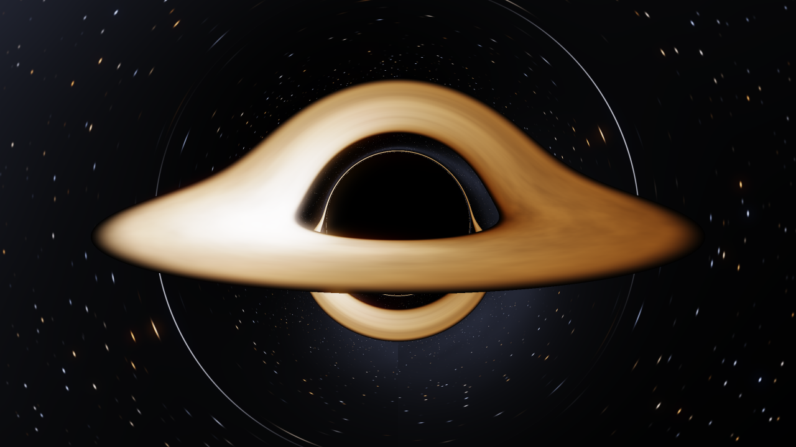
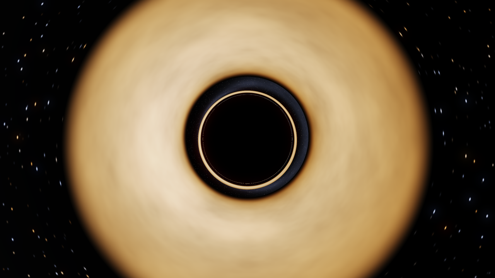
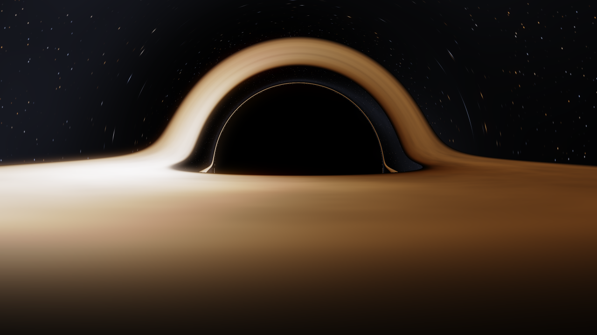
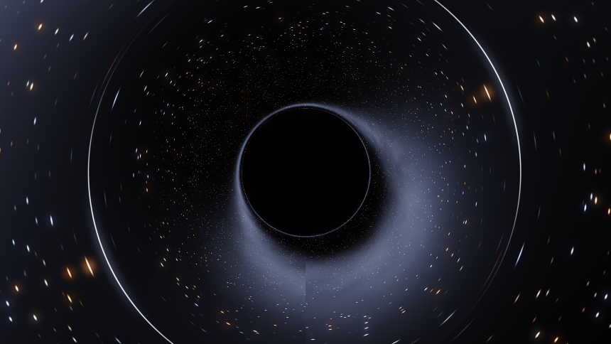
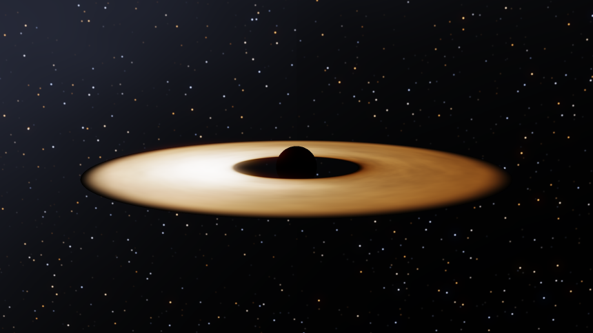
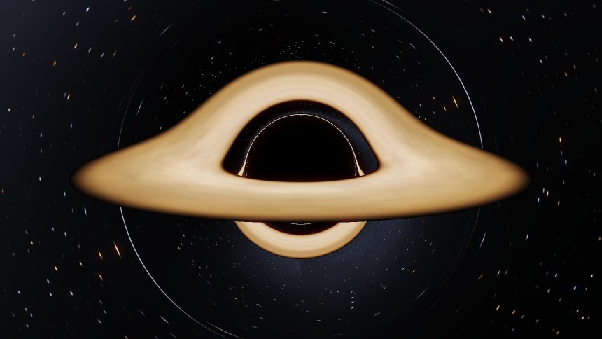
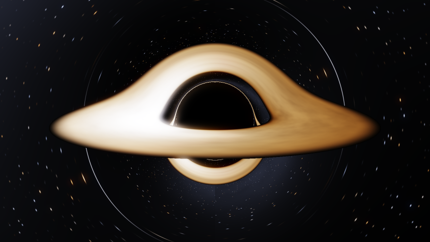

<div align="center">

# Schwarzschild Ray Tracer

**A black hole rendered by integrating the null geodesic equation, one ordinary differential equation per pixel, in real time in the browser.**

[](LICENSE)
[](https://github.com/engineering87/schwarzschild-raytracer/actions/workflows/verify.yml)
[](https://github.com/engineering87/schwarzschild-raytracer/actions/workflows/pages.yml)


[](docs/PROVENANCE.md)

### [Open the live simulation](https://engineering87.github.io/schwarzschild-raytracer/)



<sub>Observer at r = 60 M, 10 degrees above the disk plane. Rendered by <code>tools/render_reference.py</code>, which runs the same equations on the CPU.</sub>

</div>

---

## What this is

Most black hole visualisations are artwork. A torus is textured, a lens
distortion is applied, and the result is tuned until it looks convincing. This
one is not. Every pixel here is the endpoint of a photon trajectory integrated
backwards through the Schwarzschild metric with fourth order Runge-Kutta, and
every feature in the image is a consequence of that integration rather than a
decision made by the author.

Because the Schwarzschild solution is spherically symmetric, a light ray can
never leave the plane containing the observer and its own direction. That
reduces the trajectory to a single equation in the inverse radius $u = 1/r$:

$$\frac{d^{2}u}{d\varphi^{2}} + u = 3\left(\frac{GM}{c^{2}}\right)u^{2}$$

Remove the term on the right and the solution is a straight line in polar
coordinates. That term, and only that term, is general relativity. It is not
a correction applied on top of flat optics. The renderer integrates the
equation as written, so the weak field result $\alpha = 4GM/(c^{2}b)$ emerges on
its own at large impact parameter instead of being assumed.

## What you are looking at

Nothing in the picture above was drawn. Each of these is an output.

| Feature | Where it comes from |
| --- | --- |
| **The shadow** | Rays that reach $r < 2M$ are captured. Its edge is the set of rays with impact parameter $3\sqrt{3}\,M \approx 5.196\,M$, which is 2.6 times the horizon radius. |
| **The disk arcing over the hole** | The far side of the disk, seen over the top because the trajectories bend by more than the disk inclination. |
| **The disk arcing under the hole** | The underside of the far half, seen through the space below the hole. Both images exist at once, which Luminet first computed in 1979. |
| **The thin bright rim on the shadow** | The photon ring, formed by rays that wound around the photon sphere at $r = 3M$ before escaping. |
| **The left side brighter and whiter** | Relativistic beaming. The disk material at the ISCO orbits at exactly $c/2$ as measured locally, so the approaching side is boosted. |
| **The right side dimmer and more orange** | The same effect with the sign reversed, combined with gravitational redshift. |
| **Faint circles in the star field** | Einstein rings. Background stars imaged more than once by the same gravitational lens. |

The beaming is not a stylistic exaggeration, and it is measurable.
`tools/measure_beaming.py` sums the linear luminance of the two halves of the
hero frame and reports the ratio. Switching the Doppler factor off is the
control: the frame becomes symmetric to two decimal places, which shows the
asymmetry comes from that single term rather than from the geometry.

```
$ python3 tools/measure_beaming.py
approaching half       9431.3
receding half          2071.5
ratio                     4.55

$ python3 tools/measure_beaming.py --doppler off
approaching half       4458.2
receding half          4449.8
ratio                     1.00
```

## Verified, not asserted

A renderer that claims to solve physics should prove it. `tools/verify_geodesics.py`
checks the integrator against two quantities with exact closed forms, using the
same arithmetic the shader runs, and it runs on every push.

**The photon capture cross-section.** Bisecting on the impact parameter finds
the boundary between capture and escape. It has to be $3\sqrt{3}\,M$, because that is
the impact parameter of the unstable circular photon orbit. This one number
sets the angular size of the shadow in every frame.

```
measured   b_crit = 5.196152423 M
analytic 3*sqrt(3) = 5.196152423 M
absolute error     = 1.78e-13
```

**Light deflection.** The measured bending is compared against the
post-Newtonian expansion

$$\alpha = \frac{4M}{b} + \frac{15\pi}{4}\left(\frac{M}{b}\right)^{2} + \frac{128}{3}\left(\frac{M}{b}\right)^{3} + \cdots$$

| $b/M$ | measured $\alpha$ | $4M/b$ | through 2nd order | residual | 3rd order term |
| ---: | ---: | ---: | ---: | ---: | ---: |
| 30 | 0.148248087 | 0.133333333 | 0.146423303 | 1.83e-03 | 1.58e-03 |
| 50 | 0.085083450 | 0.080000000 | 0.084712389 | 3.71e-04 | 3.41e-04 |
| 100 | 0.041222540 | 0.040000000 | 0.041178097 | 4.44e-05 | 4.27e-05 |
| 400 | 0.010074304 | 0.010000000 | 0.010073631 | 6.73e-07 | 6.67e-07 |

What is left over after the second order term tracks the third order term to
about one percent. That is exactly what a correct integration truncated at a
known order should do. Reducing the step from 0.004 to 0.0005 moves the answer
by 8e-10 radians, so what remains is series truncation rather than numerics.

## Gallery

Every image below is produced by the same code path, and every pair differs by
a single switch.

<table>
<tr>
<td width="50%"></td>
<td width="50%"></td>
</tr>
<tr>
<td><b>Face-on.</b> Looking down the disk axis. Beaming disappears because no
material moves along the line of sight, and the photon ring closes into a
complete circle.</td>
<td><b>Close to the plane at r = 17 M.</b> The photon ring separates from the
shadow edge, and background stars are visible in the gap between them.</td>
</tr>
<tr>
<td></td>
<td></td>
</tr>
<tr>
<td><b>Lensing alone.</b> The disk is switched off. The concentric arcs are
Einstein rings: the same background stars imaged repeatedly around the
shadow.</td>
<td><b>Lensing switched off.</b> The $3Mu^{2}$ term is set to zero, so
rays travel in straight lines. This is what the same disk would look like under
Newtonian optics. It is a comparison mode, not a solution.</td>
</tr>
<tr>
<td></td>
<td></td>
</tr>
<tr>
<td><b>Doppler term disabled.</b> The frame becomes left-right symmetric. The
asymmetry in the hero image is entirely this one factor.</td>
<td><b>Gravitational redshift disabled.</b> The inner disk brightens and shifts
blue, because the climb out of the potential well is no longer being paid
for.</td>
</tr>
</table>

## Running it

The simulation is a single self-contained HTML file with no build step, no
bundler, and no runtime dependency. Clone the repository and open `index.html`,
or serve the directory:

```bash
git clone https://github.com/engineering87/schwarzschild-raytracer.git
cd schwarzschild-raytracer
python3 -m http.server 8000
```

Then open <http://localhost:8000>. A WebGL 2 context is required.

**Controls.** Drag to orbit, scroll to change the observer radius, and use the
console on the right for everything else. The frame accumulates jittered
samples while the camera is still and reports `converged` when it settles, so
leaving it alone for a few seconds produces a clean image suitable for
capture. The `Save PNG` button writes the current frame.

**Performance.** The cost is roughly $\text{pixels} \times \text{steps}$, and a ray that escapes
or hits the disk stops early. On a discrete GPU the defaults run interactively
at 1080p. On integrated graphics, lower `Render scale` to 0.6 and
`Integration steps` to 400 first. Neither change alters the physics, only how
finely and how far each ray is followed.

## Reproducing the images

Every picture in this README is generated from source by a NumPy
reimplementation of the same algorithm, so the repository contains no image
that cannot be regenerated on a machine with no GPU and no browser.

```bash
pip install -r tools/requirements.txt
python3 tools/render_reference.py --list
python3 tools/render_reference.py --scene edge --width 1280 --ss 2
```

The reference renderer exists for a second reason. If a change to the shader
makes the GPU output diverge from the CPU output, one of the two is wrong, and
having both makes that visible instead of plausible.

## What is not modelled

This matters more than the feature list. The full discussion is in
[docs/PHYSICS.md](docs/PHYSICS.md).

- **Spin is zero.** This is Schwarzschild, not Kerr. There is no frame
  dragging and no ergosphere. Real holes almost certainly rotate, and for a
  maximally spinning one the ISCO moves from $6M$ to $M$, which changes both
  the temperature profile and the shape of the shadow.
- **Colour is a mapping, not a measurement.** A real disk peaks in the
  ultraviolet or in soft X-rays, so none of it is visible. The peak temperature
  control projects the physical profile onto the visible band. The shape of the
  profile is physical, the absolute temperature is a display choice.
- **There is no plasma physics.** No magnetohydrodynamics, no corona, no
  Comptonisation, no synchrotron emission, no jet, and no absorption along the
  path. The disk is an opaque blackbody surface.
- **The turbulence texture is decorative.** The banding is procedural noise
  sheared by the real Keplerian rotation law. The shear is physical and the
  pattern is not.
- **The star field is invented.** Its lensing is a genuine output of the
  integration, but the stars themselves are procedural rather than a catalogue.
- **Deflection beyond the escape radius is dropped.** The residual is of order
  $M/r_{\mathrm{escape}}$, roughly half a degree at the default setting, and it shrinks as
  the setting is raised.

## Repository layout

```
index.html                    the simulation, self-contained, no build step
docs/PHYSICS.md               derivations, the frequency shift, verification results
docs/PROVENANCE.md            how this was authored, and how to compare other models
docs/media/                   every image in this README, all regenerable
tools/render_reference.py     NumPy reimplementation used to produce the images
tools/verify_geodesics.py     numerical checks against exact closed forms
tools/measure_beaming.py      measures the Doppler asymmetry, with a control
.github/workflows/verify.yml  runs the checks on every push
.github/workflows/pages.yml   publishes index.html to GitHub Pages
```

## References

The physics is standard and old. The novelty here is only that it runs at
sixty frames per second in a tab.

- K. Schwarzschild, Sitzungsberichte der Preussischen Akademie der
  Wissenschaften, 189, 1916.
- C. W. Misner, K. S. Thorne, and J. A. Wheeler, *Gravitation*, Freeman, 1973.
- J. M. Bardeen, in *Black Holes*, Les Houches 1972, Gordon and Breach, 1973.
- N. I. Shakura and R. A. Sunyaev, Astronomy and Astrophysics 24, 337, 1973.
- J.-P. Luminet, Astronomy and Astrophysics 75, 228, 1979.
- Event Horizon Telescope Collaboration, Astrophysical Journal Letters 875, 2019.

One citation is flagged as unverified. The Planckian locus is evaluated with a
cubic approximation of the CIE 1931 chromaticity coordinates that is commonly
attributed to Kim et al. (2002). That bibliographic reference has not been
checked directly and should be treated as unconfirmed. The fit itself has been
validated against blackbody chromaticities from 1700 K to 25000 K.

## Provenance

Every line of code, every image, and every document in this repository was
produced by **Anthropic Claude Opus 5** in a single session on 13 August 2026,
from a one sentence brief that specified no metric, no integration scheme, no
disk model, and no verification strategy. The human role was the brief,
direction, and review.

This is stated plainly because the repository is the reference point of a
comparison study: the same brief will be given to other models, and the results
compared. [docs/PROVENANCE.md](docs/PROVENANCE.md) records the exact brief, what
was verified and what was not, the course corrections made during the session
including the ones that were mistakes, and a checklist of the specific places
where a plausible looking black hole renderer can be quietly wrong.

The verification scripts in `tools/` are deliberately independent of the rest of
the project, so another model's integrator can be dropped into
`tools/verify_geodesics.py` and graded on numbers rather than on appearance.

Equations in this repository are typeset rather than approximated with plain
text. The Markdown files use the LaTeX support built into GitHub, and the
simulation typesets its own equations in HTML and CSS, with real fractions,
radicals, and raised exponents, so that no external typesetting library is
loaded at runtime.

## Contributing

Issues and pull requests are welcome. See [CONTRIBUTING.md](CONTRIBUTING.md).
One rule matters more than the others: a change that alters the physics has to
come with the verification output showing that
`tools/verify_geodesics.py` still passes.

## Citing this work

See [CITATION.cff](CITATION.cff), or use the *Cite this repository* button in
the GitHub sidebar.

## License

MIT. See [LICENSE](LICENSE).
